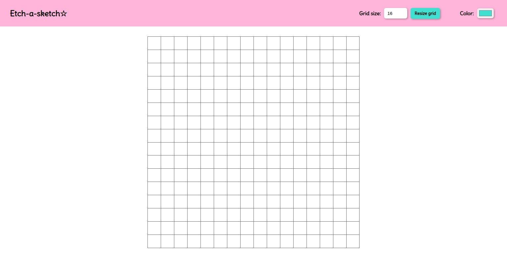

# Etch-a-sketch☆

## Description

This project is a browser version of etch-a-sketch I made for the Odin Project to practice DOM manipulation. Users can resize the sketching grid and select different colors for the brush. It was developed using HTML, CSS and JavaScript.

## Visuals



## Installation 🔧

1. Clone this repository on your local machine.

```bash
git clone https://github.com/aolivos15/odin-etch-a-sketch.git
```

1. Navigate to the directory of the project.

```bash
cd odin-etch-a-sketch
```

1. Open the file `index.html` in your web browser.

## Deployment 📦

You can implement this project in a web server or use it locally without the need for additional deployment steps.

## Built with 🛠️

This project was built using the following tools:

* HTML - Website structure
* CSS - Styles
* JavaScript - Functionality of the sketch grid

## License 📄

This project is under the MIT license. Check the [LICENSE](LICENSE) file for more details.

## Acknowledgments 🎁

This readme file has been developed using the following project as a reference:

* [template-readme-es](https://github.com/brayandiazc/template-readme) - created by [Brayan Diaz C](https://github.com/brayandiazc)

---
⌨ ️with ❤️ by [Andrea Olivos](https://github.com/aolivos15) 😊